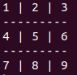

# Tic-tac-toe
Tic-tac-toe or Xs and Os is a paper-and-pencil game for two players, X and O, who take turns marking the spaces in a 3×3 grid. The player who succeeds in placing three of their marks in a horizontal, vertical, or diagonal row is the winner.

## Instructions and Game rules

### Instructions
- Execute `main.rb` file from bin directory.
- Enter your names and symbols.
- Enter number from 1-9 according to game rules.

### Game Rules
- The game is played on a grid that's 3 squares by 3 squares.

- You can choose from two symbols either 'X' or 'O', your friend will automatically be allocated the other symbol. Players take turns putting their symbols in empty squares.

- The first player to get 3 of her symbols in a row (horizontally, vertically or diagonally) is the winner.

- When all 9 squares are full, the game is over. If no player has 3 symbols in a row, the game ends in a draw.

## Built with

Ruby

## Getting Started
Clone or fork the repository.
Execute `main.rb` file

## Authors

👤 **Rahma Halane**

- Github: [@Imahnama](https://github.com/imahnama)
- Twitter: [@halane_rahma](https://twitter.com/halane_rahma)
- Linkedin: [Rahmahalane](https://linkedin.com/Rahmahalane)

👤 **Phylis Chepchumba**

- Github: [@phlylis05](https://github.com/phlylis05)
- Linkedin: [PhylisChepchumba](https://linkedin.com/PhylisChepchumba)
- Twitter: [chepchumba05](https://twitter.com/chepchumba05)

## 🤝 Contributing

Contributions, issues and feature requests are welcome! Start by:

- Forking the project
- Cloning the project to your local machine
- `cd` into the project directory
- Run `git checkout -b your-branch-name`
- Make your contributions
- Push your branch up to your forked repository
- Open a Pull Request with a detailed description to the development branch of the original project for a review

## Show your support

Give a ⭐️ if you like this project!